# 🚀 Enterprise Multi-Agent Research System (ResearchMind)

<p align="center">
  <strong>An Autonomous Multi-Agent Research Architecture powered by LangGraph, Mistral AI, Tavily Search, and Pydantic Structured Reflection.</strong>
</p>

<p align="center">
  
  
  
  
  
  
  
</p>

---

## 🌟 Executive Overview

**ResearchMind** is an enterprise-grade, autonomous multi-agent research framework. Rather than executing a single, brittle LLM prompt, the system deploys a team of specialized agents organized as a **Stateful Directed Acyclic Graph with Dynamic Reflection Loops** using **LangGraph**.

### What Makes This System Recruiter & Engineering-Grade?
- **True LangGraph Orchestration**: State is managed via typed definitions (`TypedDict`) with deterministic node transitions and conditional routing edges.
- **Autonomous Self-Correction (Reflection Loop)**: When the Critic agent detects factual gaps or weak citations (score `< 8/10`), the graph conditionally routes back to the Writer/Researcher for targeted revision (up to `max_revisions=2`).
- **Strategic Query Decomposition**: A Planner agent deconstructs ambiguous topics into 3 orthogonal search angles (Foundations, State-of-the-Art 2025/2026, and Production Challenges/Benchmarks).
- **Schema-Enforced Outputs (Pydantic v2)**: Eliminates unstructured text parsing; uses strict schema validation for query plans and multidimensional audit scores.
- **Resilient Content Extraction**: BeautifulSoup web scraper with automatic tag decomposition (scripts, navigation, ads), rate limiting, and exception-safe fallbacks.
- **Complete Test Suite & CI/CD**: 100% passing `pytest` suite with mocked HTTP/LLM fixtures, Dockerfile, and GitHub Actions CI.

---

## 🏗️ System Architecture & Workflow

The architecture uses a cyclical multi-agent graph with dynamic feedback gating:

```mermaid
graph TD
    START([User Topic]) --> PlanNode["01. Planner Agent<br/>(Query Decomposition)"]
    PlanNode --> ResearchNode["02. Researcher Agent<br/>(Multi-Query Tavily Search)"]
    ResearchNode --> CurateNode["03. Curator Agent<br/>(Deep BeautifulSoup Scraping)"]
    CurateNode --> WriteNode["04. Writer Agent<br/>(Report Synthesis & Inline Citations)"]
    WriteNode --> CriticNode["05. Critic Agent<br/>(Pydantic Structured Quality Audit)"]
    
    CriticNode --> QualityGate{Score >= 8 OR<br/>Revisions >= 2?}
    QualityGate -- "No (Needs Improvement)" --> WriteNode
    QualityGate -- "Yes (Passed)" --> EndNode([Final Verified Report & Telemetry])

    style PlanNode fill:#1e1e2f,stroke:#ff8c32,stroke-width:2px
    style ResearchNode fill:#1e1e2f,stroke:#00b4d8,stroke-width:2px
    style CurateNode fill:#1e1e2f,stroke:#ffd166,stroke-width:2px
    style WriteNode fill:#1e1e2f,stroke:#50c878,stroke-width:2px
    style CriticNode fill:#1e1e2f,stroke:#e92063,stroke-width:2px
    style QualityGate fill:#2b2b3d,stroke:#ff8c32,stroke-width:2px
```



### Agent Roles & Specifications

| Agent | Module | Core Functionality |
| :--- | :--- | :--- |
| **Planner** | `src/agents/planner.py` | Decomposes topic into 3 orthogonal search angles with structured Pydantic output. |
| **Researcher** | `src/agents/researcher.py` | Executes targeted Tavily queries concurrently with URL deduplication. |
| **Curator** | `src/agents/curator.py` | Selects highest-authority domains and extracts full-body article text. |
| **Writer** | `src/agents/writer.py` | Synthesizes an authoritative report with inline domain links and addresses past critique feedback. |
| **Critic** | `src/agents/critic.py` | Audits accuracy, coverage, clarity, and citations with strict Pydantic scoring (`CriticReview`). |

---

## 📂 Modular Clean Architecture

```
Multi Agent System/
├── src/
│   ├── agents/
│   │   ├── planner.py       # Query decomposition agent
│   │   ├── researcher.py    # Multi-query Tavily aggregator
│   │   ├── curator.py       # Deep article extraction & cleaning
│   │   ├── writer.py        # Report synthesis with inline citations
│   │   ├── critic.py        # Multi-criteria Pydantic reflection evaluator
│   │   └── llm.py           # Configured Mistral Chat LLM factory
│   ├── tools/
│   │   ├── search.py        # Tavily client wrapper with deduplication
│   │   └── scraper.py       # Robust BeautifulSoup HTML content cleaner
│   ├── state.py             # ResearchState TypedDict & Pydantic models
│   ├── graph.py             # Compiled LangGraph StateGraph & conditional edges
│   └── config.py            # Pydantic Settings & environment loader
├── tests/
│   ├── test_graph.py        # StateGraph compilation & reflection edge routing
│   ├── test_state.py        # Pydantic schema validation & bounds checks
│   └── test_tools.py        # Scraper tag cleaning & search deduplication
├── .github/workflows/
│   └── ci.yml               # Automated CI matrix (Python 3.11 & 3.12)
├── app.py                   # Streamlit UI with live LangGraph streaming & HUD
├── pipeline.py              # Direct CLI pipeline runner with rich console tables
├── Dockerfile               # Production container image
├── requirements.txt         # Pinned production dependencies
└── README.md                # Technical documentation
```

---

## ⚡ Quickstart

### 1. Prerequisites & Environment Setup

```bash
# Clone the repository
git clone https://github.com/your-username/Multi-Agent-Research-System.git
cd Multi-Agent-Research-System

# Create and activate virtual environment
python -m venv .venv
source .venv/bin/activate  # On Windows: .\.venv\Scripts\Activate.ps1

# Install dependencies
pip install -r requirements.txt
```

### 2. Configure API Keys

Create a `.env` file in the root directory:

```env
MISTRAL_API_KEY="your-mistral-api-key"
TAVILY_API_KEY="your-tavily-api-key"
```

*(Get free API keys at [Mistral AI Console](https://console.mistral.ai/) and [Tavily Search](https://tavily.com/)).*

---

## 🚀 Running the Application

### Option A: Interactive Web UI (Streamlit)

Launch the modern dark-themed web interface with live streaming progress:

```bash
streamlit run app.py
```
Open [http://localhost:8501](http://localhost:8501) in your browser. Features:
- **Live Graph Stepper**: Visual real-time indicator of LangGraph node activations.
- **Telemetry HUD**: Latency per agent, sources consulted, and revision count.
- **Recruiter Presets**: Instant 1-click benchmark evaluation topics.
- **Export**: One-click Markdown (`.md`) and Session Telemetry (`.json`) download.

### Option B: Terminal CLI Runner

Execute research directly from your command line:

```bash
python pipeline.py "Autonomous Multi-Agent AI Frameworks 2025"
```

---

## 🧪 Running Automated Tests

Run the full `pytest` suite covering tools, graph state transitions, and edge reflection logic:

```bash
pytest tests/ -v
```

Output:
```
tests/test_graph.py::test_graph_compilation PASSED
tests/test_graph.py::test_should_revise_passes PASSED
tests/test_graph.py::test_should_revise_triggers_revision PASSED
tests/test_graph.py::test_should_revise_respects_max_revisions PASSED
tests/test_state.py::test_sub_query_plan_valid PASSED
tests/test_state.py::test_sub_query_plan_invalid_bounds PASSED
tests/test_state.py::test_critic_review_valid PASSED
tests/test_state.py::test_critic_review_score_out_of_bounds PASSED
tests/test_tools.py::test_extract_web_content_success PASSED
tests/test_tools.py::test_extract_web_content_failure PASSED
tests/test_tools.py::test_search_tavily_deduplication PASSED

============================= 11 passed in 1.11s ==============================
```

---

## 🐳 Docker Deployment

Build and launch via Docker in seconds:

```bash
# Build Docker image
docker build -t research-mind .

# Run container
docker run -p 8501:8501 --env-file .env research-mind
```

---

## 📊 Design Decisions & Engineering Trade-Offs

| Decision | Alternative Evaluated | Why Chosen |
| :--- | :--- | :--- |
| **LangGraph `StateGraph`** | Sequential procedural chains | State persistence across agent steps, native branching, cycle detection, and conditional loops. |
| **Pydantic Structured Outputs** | Freeform text with regex | Guaranteed parse safety, strict numerical range constraints (`Field(ge=1, le=10)`), and compile-time type safety. |
| **Iterative Reflection Loop** | Single-pass generation | Peer-review simulation catches hallucinations, thin content, and missing sources, boosting quality to publication standards. |
| **Hybrid Tavily + BeautifulSoup** | Raw search snippets only | Search snippets provide broad indexing, but deep scraping ensures high technical density for synthesis. |

---

## 📜 License

Distributed under the MIT License. See `LICENSE` for more information.
